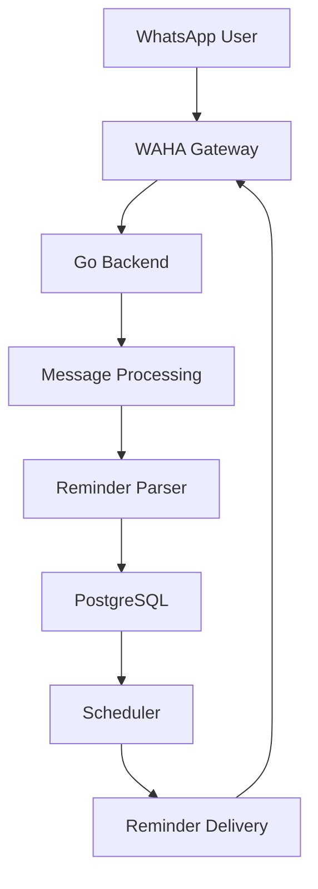

# Nemoris

> **One message sent. System never forgets.**

Nemoris is a **WhatsApp-native AI memory assistant** built for people who want memory, reminders, and follow-up actions handled through natural conversation.

Instead of opening apps, creating tasks manually, or managing calendars, users simply send a message:

```text
remind me to pay electricity tomorrow 8pm
```

Nemoris turns that into structured memory, schedules it safely, and delivers it back when needed.

---

# Why Nemoris Exists

Modern productivity tools require users to adapt to software.

Nemoris does the opposite:

- talk naturally
- send one message
- memory becomes structured automatically

The goal is simple:

> **Memory should feel invisible.**

---

# Core Product Vision

Nemoris is designed as a long-term personal memory layer:

- reminders
- recurring tasks
- notes
- future commitments
- contextual memory
- intelligent follow-up

Future direction:

- voice-first capture
- media understanding
- calendar integration
- proactive personal assistant behavior

---

# Current Stack

```text
Go
WAHA (WhatsApp HTTP API)
PostgreSQL
Redis
Docker Compose
```

Current architecture prioritizes:

- production safety
- low operational complexity
- stable local development
- gradual scalability

---

# Architecture



---

# Current Development Principle

Nemoris is being built incrementally:

```text
receive → validate → persist → schedule → send
```

No premature abstraction.

Every layer must work safely before expanding.

---

# Folder Structure

```text
backend/
├── cmd/api/main.go
├── internal/
│   ├── database/
│   ├── handler/
│   ├── model/
│   ├── repository/
│   ├── service/
│   ├── scheduler/
│   ├── whatsapp/
│   └── utils/
├── Dockerfile
└── go.mod
```

---

# Current Features

- webhook receive from WhatsApp
- duplicate protection
- self-message protection
- reminder parsing
- PostgreSQL persistence
- reminder listing API

---

# Example Flow

User sends:

```text
remind me to call mom tomorrow 7pm
```

System stores:

```json
{
  "task": "call mom",
  "time": "tomorrow 7pm"
}
```

Then schedules safe delivery.

---

# Production Philosophy

Nemoris is not being built as a prototype toy.

Main rules:

- PostgreSQL = source of truth
- Redis = scheduling layer
- GORM only inside repository
- handlers never touch DB directly
- outbound WhatsApp safety first

---

# Long-Term Goal

Nemoris should eventually become:

> **an invisible reliable memory infrastructure living inside daily chat**

Users should never think about task systems again.

---

# Status

Current phase:

```text
MVP Core Backend
```

Already working:

- WAHA connected
- Go backend running
- PostgreSQL connected
- reminder persistence active

Next:

- real scheduler
- outbound reminder delivery
- AI intent extraction

---

# Development Environment

Machine baseline:

```text
MacBook Air M1
8GB RAM
```

Container policy:

```text
WAHA + PostgreSQL + Redis only
Go backend local during MVP
```

---

# Repository Direction

This repository documents a real production path:

not tutorial code,
not overengineered boilerplate,
but incremental system construction.

---

# Philosophy

> **Chat-first software wins when friction disappears.**

---

# Follow Development

This project is actively evolving architecture-first.

The objective is not just sending reminders.

The objective is building:

> **a memory system users trust without thinking about it**
