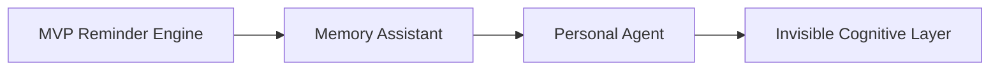

# NEMORIS Master Roadmap v1

## Mission

> One message sent, system never forgets.

NEMORIS is being built as a **WhatsApp-native AI memory layer**:

- invisible
- reliable
- production safe
- low-friction
- emotionally useful

The product goal is not only reminders.
The long-term goal is **persistent external memory for humans through chat**.

---

# Product Evolution Map



---

# Phase 1 — MVP Foundation (Current Stage) ✅

## Objective

Prove that one incoming message can safely become a stored reminder.

## Completed

- WAHA connected
- Docker baseline stable
- PostgreSQL active
- Redis active
- Go backend running locally
- webhook intake working
- message persistence working
- duplicate protection active
- self-message protection active
- reminder parsing active
- reminder save active
- reminder listing active

## Current MVP capability

```text
message → parse → persist → list
```

## Success definition

A reminder survives restart and can be retrieved safely.

---

# Phase 2 — Scheduler Core (Immediate Next) 🚀

## Objective

Make reminders execute automatically.

## Build sequence

1. polling scheduler every minute
2. load due reminders
3. mark processed reminders
4. prevent duplicate execution

## First MVP output

```text
Reminder due: pay electricity
```

## Why this matters

This is where storage becomes behavior.

## Safety rule

No WA send yet until scheduler trusted.

---

# Phase 3 — WhatsApp Outbound Delivery

## Objective

Send reminders back to WhatsApp.

## Build sequence

1. WAHA sendText integration
2. payload inspection
3. delivery logging
4. failure handling

## Safety first

Must prevent loops:

```text
send only scheduler-originated messages
```

## Production milestone

First real full loop:

```text
user message → database → scheduler → WA reply
```

---

# Phase 4 — Strong Time Intelligence

## Objective

Upgrade time parsing from simple rules into robust natural time.

## Required support

```text
next monday 7am
in 2 hours
15 march 9pm
this friday after lunch
```

## Build priority

Deterministic parser first.

LLM later only if needed.

## Reason

Time parsing is high-risk production logic.

---

# Phase 5 — Recurring Reminder Engine

## Objective

Support recurring tasks.

## Examples

```text
every monday
monthly rent
weekly report
```

## Schema upgrade

Add:

- recurrence
- next_run_at
- status
- last_sent_at

## Important

Recurring logic must be idempotent.

---

# Phase 6 — AI Intent Layer

## Objective

Move from command parser into semantic understanding.

## AI should classify

- reminder
- memory
- note
- question
- retrieval

## Example

```text
remember my passport expires in december
```

## Output target

Structured JSON contract.

---

# Phase 7 — Memory System

## Objective

Separate reminders from long-term memory.

## Memory examples

```text
my wife likes jasmine tea
my passport expires december
my favorite doctor is dr andi
```

## Required new domain

```text
memory repository
memory retrieval service
```

## Product shift

This is where NEMORIS stops being reminder app.

---

# Phase 8 — Searchable Retrieval Layer

## Objective

Allow conversational recall.

## Example

```text
what do i need to renew this month?
```

## Build options

- SQL retrieval first
- embeddings later

---

# Phase 9 — Redis Delayed Jobs

## Objective

Replace polling scheduler with queue-based scheduling.

## Recommended stack

```text
Asynq
```

## Why later

Current MVP must first prove scheduler correctness.

## Production benefit

- retries
- delayed jobs
- resilience

---

# Phase 10 — Voice Note Pipeline

## Objective

Support natural voice reminders.

## Flow

```text
WAHA media → download → transcription → parser
```

## Recommended path

Whisper API first.

---

# Phase 11 — Daily Assistant Mode

## Objective

NEMORIS becomes proactive.

## Example

```text
Good morning, today you have 3 pending reminders.
```

## Value jump

Moves from passive storage into active utility.

---

# Phase 12 — Calendar + External Sync

## Integrations

- Google Calendar
- Email reminders
- external webhook triggers

---

# Phase 13 — Production Hardening

## Required

- structured logging
- migration tool
- retry policy
- dead-letter handling
- webhook auth
- WAHA auth hardening
- backup automation

## Mandatory before public release

No public usage before this phase.

---

# Phase 14 — Multi-User Production

## Objective

Support many users safely.

## Required

- user isolation
- per-user scheduling
- quota control
- abuse protection

---

# Phase 15 — Monetization Layer 💰

## Possible models

### Consumer

- premium reminder tiers
- AI memory subscription

### Business

- executive assistant
- team reminders
- operational memory bot

## Strongest early monetization

WhatsApp memory assistant for professionals.

---

# Infrastructure Evolution Path

## Today

```text
WAHA + PostgreSQL + Redis + Local Go
```

## Next

```text
Docker backend + worker
```

## Production

```text
Nginx + backend + worker + postgres + redis + backup
```

## Later

```text
split infra only when needed
```

---

# Anti-Fragile Engineering Rules

## Always preserve

- no direct handler → repository shortcut
- no GORM outside repository
- inspect WAHA payload before assumptions
- no outbound auto-send before safe validation

## Always prefer

- boring architecture
- predictable behavior
- recoverable failure

---

# Product Philosophy

NEMORIS should feel like:

> memory without friction

Not:

> another bot.

---

# Launch Definition

You are launch-ready when:

```text
100 reminders sent correctly
0 loops
0 duplicate sends
safe restart recovery
```

---

# Long-Term Vision 🌱

NEMORIS eventually becomes:

> personal external cognition layer living inside WhatsApp.
