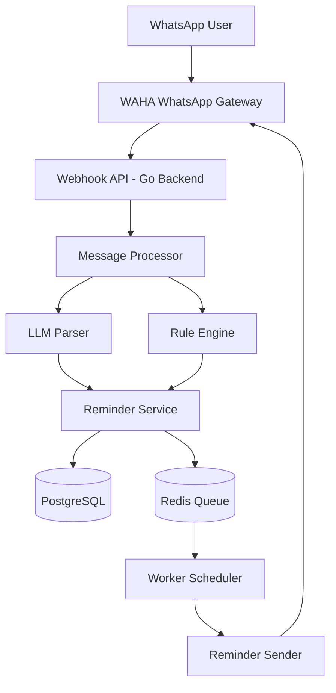
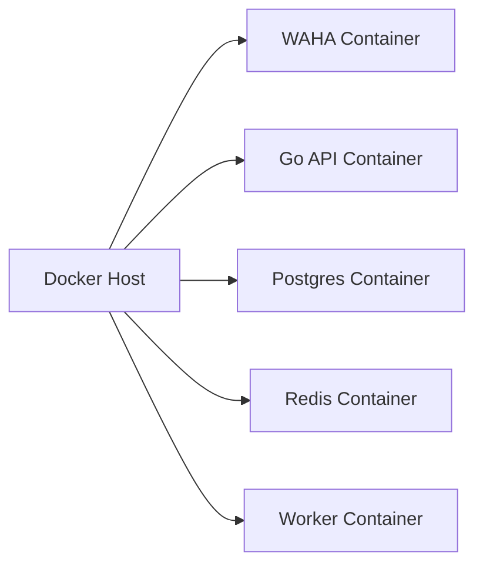
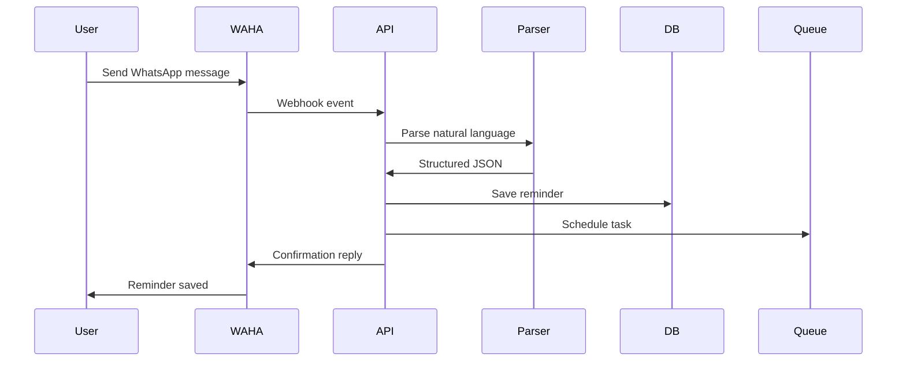
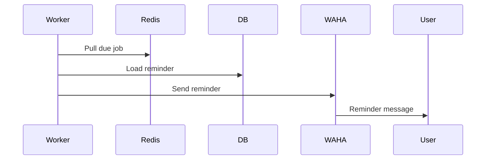
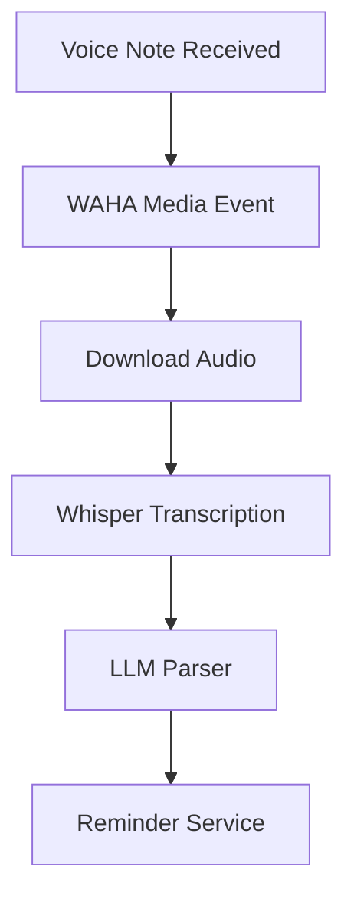
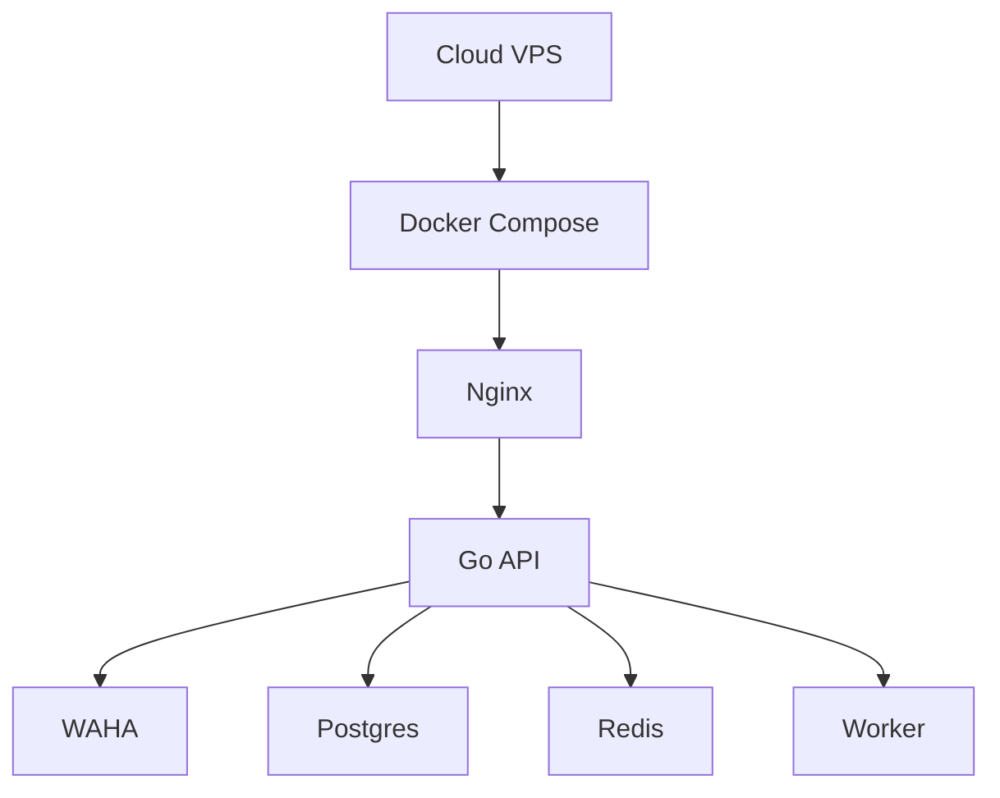

# Nemoris — Architecture & Technical Documentation

## Overview

**Nemoris** is a WhatsApp-native AI memory assistant built to help users store reminders, tasks, notes, and schedules through natural conversation.

Core product goal:

> Users send text, voice, or media via WhatsApp, and Nemoris transforms it into structured memory, reminders, and intelligent follow-up actions.

---

# 1. Product Scope

## Core MVP Features

- WhatsApp text message reminder creation
- Natural language reminder parsing
- Scheduled reminder delivery
- Persistent memory storage
- Task listing
- Voice note transcription
- AI summarization

## Example User Interactions

```text
remind me to pay electricity tomorrow 8pm
```

```text
buy milk every monday
```

```text
remember my passport expires in december
```

```text
what are my pending tasks?
```

---

# 2. High-Level Architecture



---

# 3. Core Architecture Layers

## Messaging Layer

Responsible for WhatsApp communication.

### Technology

- WAHA Free Edition
- Dockerized session management
- Webhook-based event delivery

### Responsibilities

- Session QR login
- Incoming message delivery
- Outgoing text/media sending

---

## Backend Layer

Built in Go.

### Technology

- Go 1.22+
- Gin Framework
- REST API
- JSON Webhooks

### Responsibilities

- Receive webhook events
- Validate incoming payloads
- Route messages
- Trigger AI parsing
- Persist tasks

---

## Intelligence Layer

Transforms human language into structured commands.

### Technology Options

- OpenAI API
- Ollama local model
- Claude API

### Responsibilities

- Intent detection
- Time extraction
- Entity extraction
- Task classification

---

## Persistence Layer

### PostgreSQL

Stores:

- reminders
- tasks
- user memory
- message history

### Redis

Stores:

- delayed jobs
- retry queues
- event scheduling

---

## Worker Layer

Executes background jobs.

### Responsibilities

- Trigger reminders
- Retry failed deliveries
- Run recurring schedules

---

# 4. Container Architecture



---

# 5. Docker Compose Design

## Services

| Service  | Purpose            |
| -------- | ------------------ |
| waha     | WhatsApp gateway   |
| backend  | Main API           |
| postgres | Persistent storage |
| redis    | Queue              |
| worker   | Reminder scheduler |

---

# 6. Message Flow

## Incoming Text Message Flow



---

# 7. Reminder Execution Flow



---

# 8. Voice Note Flow

## Voice Processing Pipeline



---

# 9. AI Parsing Contract

## Input

```json
{
  "message": "remind me to call mom tomorrow at 7pm"
}
```

## Output

```json
{
  "intent": "create_reminder",
  "task": "call mom",
  "time": "2026-03-08T19:00:00"
}
```

---

# 10. Database Schema

## reminders

```sql
CREATE TABLE reminders (
    id UUID PRIMARY KEY,
    user_id TEXT NOT NULL,
    task TEXT NOT NULL,
    remind_at TIMESTAMP NOT NULL,
    recurrence TEXT,
    status TEXT DEFAULT 'pending',
    created_at TIMESTAMP DEFAULT now()
);
```

---

## users

```sql
CREATE TABLE users (
    id UUID PRIMARY KEY,
    whatsapp_id TEXT UNIQUE,
    created_at TIMESTAMP DEFAULT now()
);
```

---

## memories

```sql
CREATE TABLE memories (
    id UUID PRIMARY KEY,
    user_id UUID,
    content TEXT,
    type TEXT,
    created_at TIMESTAMP DEFAULT now()
);
```

---

# 11. Backend Module Structure

```text
backend/

cmd/api/main.go

internal/
  whatsapp/
  ai/
  reminder/
  scheduler/
  database/
  memory/
  worker/
```

---

# 12. Recommended Go Packages

| Concern   | Library        |
| --------- | -------------- |
| HTTP API  | gin            |
| DB ORM    | gorm / sqlx    |
| Queue     | asynq          |
| Migration | golang-migrate |
| Logging   | zap            |
| Config    | viper          |

---

# 13. WAHA Integration Contract

## Send Message

Endpoint:

```text
POST /api/sendText
```

Payload:

```json
{
  "chatId": "628123456789@c.us",
  "text": "Reminder saved"
}
```

---

## Webhook Receive

Expected fields:

```json
{
  "from": "628123456789@c.us",
  "body": "remind me tomorrow"
}
```

---

# 14. Suggested API Endpoints

| Endpoint   | Purpose               |
| ---------- | --------------------- |
| /webhook   | incoming WAHA webhook |
| /health    | health check          |
| /reminders | list reminders        |
| /memory    | list stored memory    |

---

# 15. Scheduling Strategy

## Preferred Approach

Use Redis queue:

```text
Asynq
```

Reason:

- delayed jobs
- retries
- production safe

---

# 16. Production Deployment Architecture



---

# 17. Security Considerations

## Required

- webhook authentication
- WAHA API token
- encrypted secrets
- database backup

## Recommended

- HTTPS
- reverse proxy
- rate limiting

---

# 18. Future Expansion

## Phase 2

- Google Calendar sync
- Multi-language parsing
- AI memory retrieval

## Phase 3

- Personal agent mode
- Team memory
- Shared reminders

---

# 19. Suggested Repository Naming

```text
nemoris-core
nemoris-api
nemoris-worker
nemoris-ai
nemoris-infra
```

---

# 20. Recommended First Build Order

## Phase 1

1. WAHA connect
2. webhook receive
3. send reply
4. parse reminder
5. save postgres
6. worker reminder

## Phase 2

7. voice transcription
8. recurring tasks
9. memory retrieval

---

# Final Principle

Nemoris should remain:

> chat-first, minimal, invisible infrastructure, strong reliability

Because users only care that:

> they send one message and it always remembers.

---
