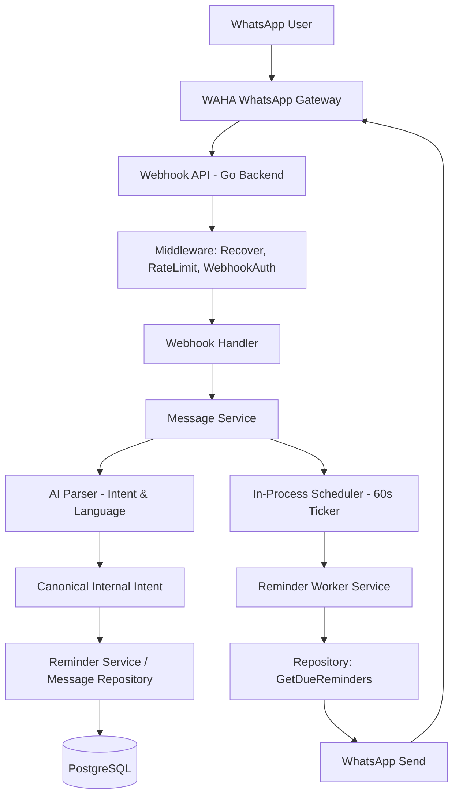
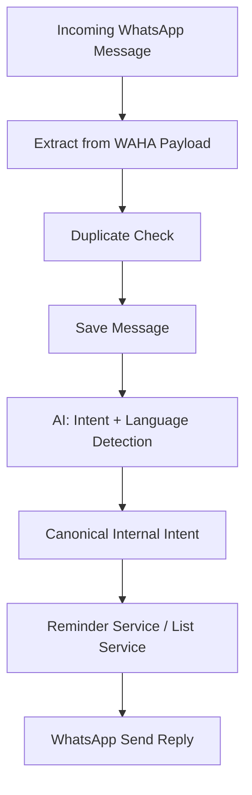
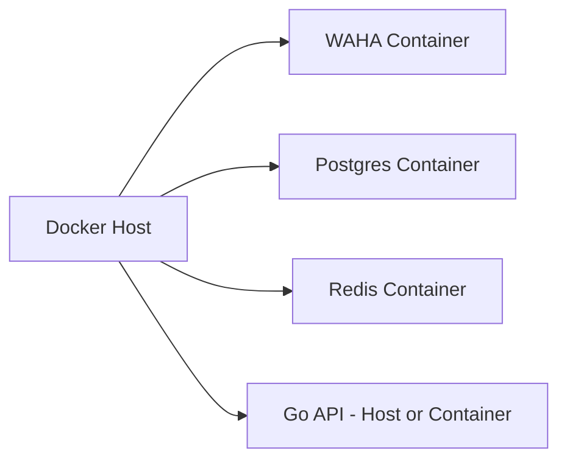
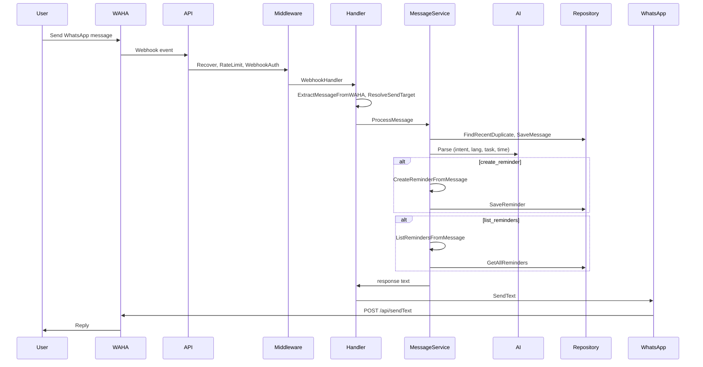
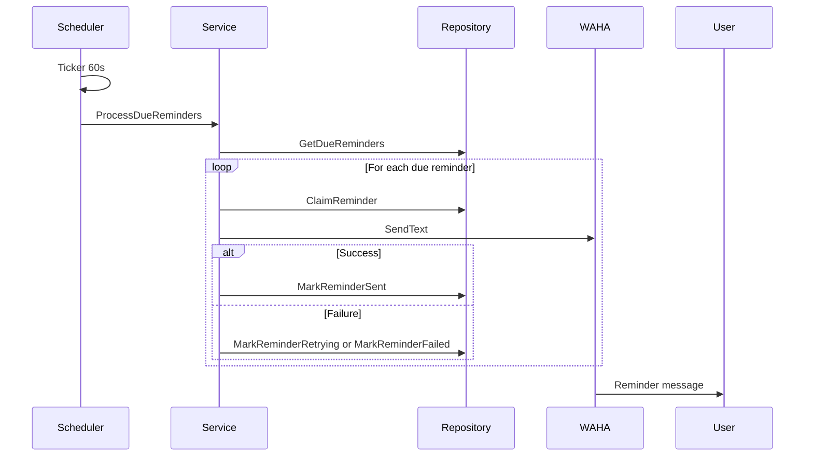

# Nemoris — Architecture & Technical Documentation

*Last updated: 2026-03-08*

## Overview

**Nemoris** is a WhatsApp-native AI memory assistant built to help users store reminders, tasks, notes, and schedules through natural conversation.

Core product goal:

> Users send text, voice, or media via WhatsApp, and Nemoris transforms it into structured memory, reminders, and intelligent follow-up actions.

## Multilingual Support (MVP)

NEMORIS supports **2 languages from MVP stage**: Indonesian (`id`) and English (`en`).

- **Bilingual user input** — Users may send messages in Indonesian or English natural language.
- **Unified internal intent processing** — All messages are converted into one language-neutral internal command model.
- **Localized replies** — Responses are generated in the user's detected language.

> NEMORIS accepts both Indonesian and English user messages while converting them into one language-neutral internal command model.

---

# 1. Product Scope

## Core MVP Features

- WhatsApp text message reminder creation
- Natural language reminder parsing (rule-based)
- Scheduled reminder delivery
- Persistent memory storage (PostgreSQL)
- Task listing
- Duplicate message prevention
- Self-message filtering
- LID (Linked ID) to phone resolution for sending

## Example User Interactions

**English:**

```text
remind me to pay electricity tomorrow 8pm
```

```text
list reminders
```

**Indonesian:**

```text
ingatkan saya untuk bayar listrik besok jam 8 malam
```

```text
daftar pengingat
```

Both languages map internally to the same canonical intent.

---

# 2. High-Level Architecture



**Message flow with multilingual support:**



- Language Detection runs inside AI layer before Intent Parsing.
- Canonical Intent remains language-independent.

---

# 3. Core Architecture Layers

## Messaging Layer (`internal/whatsapp/`)

Responsible for WhatsApp communication via WAHA.

### Technology

- WAHA Free Edition (devlikeapro/waha)
- Dockerized session management
- Webhook-based event delivery

### Responsibilities

- Session QR login (WAHA-managed)
- Incoming message extraction (`payload.go` — `ExtractMessageFromWAHA`)
- Outbound text sending (`send.go` — `SendText`)
- LID-to-phone resolution (`lid.go` — `ResolveSendTarget`, `ResolveLIDToPhone`)
- WAHA health check (`health.go` — `CheckWAHA`)

### Outbound Safety (in `send.go`)

- Empty message blocked
- Self-message blocked (BOT_NUMBER)
- Duplicate outbound suppression (10s window)
- Outbound pacing (300ms + random 0–600ms)
- Invalid chatId rejected

---

## Backend Layer

Built in Go using **standard net/http** (no Gin).

### Technology

- Go 1.23+
- Standard library `net/http`
- JSON Webhooks
- godotenv for config

### Responsibilities

- Receive webhook events
- Validate incoming payloads (middleware)
- Route messages
- Trigger AI parsing
- Persist tasks via repository

---

## Middleware Layer (`internal/middleware/`)

| Middleware    | Purpose                                      | Applied To   |
|---------------|----------------------------------------------|--------------|
| Recover       | Panic recovery, returns 500                   | All routes   |
| RateLimit     | 10 requests / 60s per IP, returns 429         | Webhook only |
| WebhookAuth   | X-Webhook-Secret validation, returns 401     | Webhook only |

Dev fallback: `?token=` query param when `APP_ENV=dev`.

---

## Intelligence Layer (`internal/ai/`)

Transforms human language into structured commands. **Rule-based only** (no external LLM in MVP).

### Technology

- Keyword-based intent detection
- Heuristic language detection
- Rule-based time parsing

### Responsibilities

- Intent detection (`intent.go` — `DetectIntent`)
- Language detection (`language.go` — `DetectLanguage`)
- Time extraction (`reminder_parser.go` — `ParseReminder`)
- Task extraction

### Multilingual Contract

The AI parser returns:

- `language` — detected source language (`id` or `en`)
- `intent` — canonical intent (language-independent)
- `task` — extracted task text
- `time` — extracted timestamp (RFC3339)

Canonical output is independent of source language.

---

## Persistence Layer

### PostgreSQL (GORM)

Stores:

- `messages` — inbound message history (duplicate check)
- `reminders` — tasks, remind_at, status, retry metadata

### Redis

- Present in Docker Compose for future use.
- **Not used in current codebase** — scheduler uses in-process ticker.

---

## Scheduler Layer (`internal/scheduler/`)

**In-process ticker** — no separate worker container, no Redis queue.

### Responsibilities

- Run every 60 seconds
- Call `service.ProcessDueReminders()`
- Reminder worker logic lives in `service/reminder_worker.go`

### Reminder Lifecycle

```text
pending → processing → sent
pending → processing → retrying (up to 3) → failed
```

---

# 4. Container Architecture



**Dev:** Backend runs on host (air/go run). Postgres, Redis, WAHA in containers.

**Prod:** Backend runs as `nemoris-api` container.

---

# 5. Docker Compose Design

## Dev (`deployments/docker-compose.dev.yml`)

| Service  | Purpose            | Port |
| -------- | ------------------ | ---- |
| postgres | Persistent storage  | 5432 |
| redis    | Future queue        | 6379 |
| waha     | WhatsApp gateway    | 3000 |

Backend runs locally.

## Prod (`deployments/docker-compose.prod.yml`)

| Service  | Purpose            | Port |
| -------- | ------------------ | ---- |
| postgres | Persistent storage  | -    |
| redis    | Future queue        | -    |
| waha     | WhatsApp gateway    | 3000 |
| backend  | Main API (nemoris-api) | 8080 |

---

# 6. Message Flow

## Incoming Text Message Flow



---

# 7. Reminder Execution Flow



---

# 8. Backend Module Structure

```text
backend/

cmd/
  api/
    main.go              # Boot: config, db, scheduler, routes, server

internal/
  ai/                    # Intent extraction, language, reminder parsing
    intent.go
    language.go
    parser.go
    reminder_parser.go
  config/
    config.go            # godotenv, AppConfig
  database/
    init.go              # Connect + Migrate
    postgres.go          # GORM connection
    migrate.go           # AutoMigrate
  handler/
    webhook.go           # WebhookHandler
    reminder_handler.go  # GetReminders, GetPendingReminders
    failed_reminder_handler.go
    health_check.go
  middleware/
    recover.go
    rate_limit.go
    webhook_auth.go
  model/
    base.go
    incoming_message.go  # IncomingMessage, WAHAWebhookEnvelope, WAHAMessagePayload
    message.go           # Message (persistence)
    reminder.go
    reminder_status.go
  repository/
    message_repository.go
    reminder_repository.go
  scheduler/
    scheduler.go         # 60s ticker → ProcessDueReminders
  service/
    message_service.go   # ProcessMessage
    reminder_service.go  # CreateReminderFromMessage, ListRemindersFromMessage
    reminder_worker.go    # ProcessDueReminders
    reminder_query_service.go
    health_service.go
  utils/
    logger.go            # LogInbound, LogOutbound, LogDB, LogScheduler, LogAI, LogSecurity, LogSystem
  whatsapp/
    send.go              # SendText, outbound safety
    payload.go           # ExtractMessageFromWAHA
    lid.go               # ResolveSendTarget, ResolveLIDToPhone
    health.go            # CheckWAHA

Dockerfile
go.mod
```

### Architecture Rule

```text
handler → service → repository → gorm → postgres
```

- Handler never calls repository directly.
- Service never uses GORM.
- All outbound WhatsApp goes through `internal/whatsapp/send.go`.

---

# 9. API Endpoints

| Endpoint            | Method | Purpose                    | Middleware              |
| ------------------- | ------ | -------------------------- | ----------------------- |
| /health             | GET    | Health check (DB + WAHA)   | Recover                 |
| /webhook            | POST   | Incoming WAHA webhook      | Recover, RateLimit, WebhookAuth |
| /reminders          | GET    | List reminders (?from=)    | Recover                 |
| /reminders/pending  | GET    | List pending reminders     | Recover                 |
| /reminders/failed   | GET    | List failed reminders (?from=) | Recover              |

---

# 10. AI Parsing Contract

## Input

**English:**

```json
{
  "message": "remind me to pay electricity tomorrow 8pm"
}
```

**Indonesian:**

```json
{
  "message": "ingatkan saya untuk bayar listrik besok jam 8 malam"
}
```

## Output (Canonical Internal Model)

Both inputs map to the same canonical output:

```json
{
  "language": "id",
  "intent": "create_reminder",
  "task": "bayar listrik",
  "time": "2026-03-08T20:00:00+07:00"
}
```

**Critical rule:** `intent` must never depend on human language.

- **Allowed:** `create_reminder`
- **Forbidden:** `buat_pengingat`

## Supported Intents

- `create_reminder`
- `list_reminders`
- `store_memory` (detected, not yet implemented)
- `ignore_smalltalk`
- `unknown`

---

# 11. Database Schema

## reminders

```sql
CREATE TABLE reminders (
    id UUID PRIMARY KEY DEFAULT gen_random_uuid(),
    "from" TEXT NOT NULL,
    task TEXT NOT NULL,
    raw_time TEXT,
    remind_at TIMESTAMP NOT NULL,
    status TEXT DEFAULT 'pending',
    sent_at TIMESTAMP,
    retry_count INT DEFAULT 0,
    last_error TEXT,
    created_at TIMESTAMP DEFAULT now()
);
```

Status values: `pending`, `processing`, `retrying`, `sent`, `failed`.

---

## messages

```sql
CREATE TABLE messages (
    id UUID PRIMARY KEY,
    "from" TEXT NOT NULL,
    body TEXT NOT NULL,
    created_at TIMESTAMP DEFAULT now()
);
```

Index: `idx_message_duplicate` on (from, body, created_at) for duplicate detection.

---

# 12. WAHA Integration Contract

## Send Message

Endpoint:

```text
POST {WAHA_BASE_URL}/api/sendText
```

Payload:

```json
{
  "session": "default",
  "chatId": "628123456789@c.us",
  "text": "Reminder noted"
}
```

Headers: `Content-Type: application/json`, `X-Api-Key` (if `WAHA_API_KEY` set).

---

## Webhook Receive

WAHA sends:

```json
{
  "event": "message",
  "session": "default",
  "payload": {
    "from": "628123456789@c.us",
    "body": "remind me tomorrow",
    "fromMe": false
  }
}
```

Fallback for tests: flat `{ "from": "...", "body": "..." }`.

---

## LID Resolution

Endpoint:

```text
GET {WAHA_BASE_URL}/api/default/lids/{lid}
```

Response: `{ "lid": "...", "pn": "628123456789@c.us" }` or `pn: null`.

Used when `from` or send target is `...@lid` — resolve to phone before sending.

---

## Health Check

```text
GET {WAHA_BASE_URL}/api/sessions
```

Returns 200 if WAHA is reachable.

---

# 13. Config & Environment

| Variable       | Purpose                          |
| -------------- | --------------------------------- |
| DB_HOST        | PostgreSQL host                   |
| DB_USER        | PostgreSQL user                   |
| DB_PASSWORD     | PostgreSQL password               |
| DB_NAME        | PostgreSQL database               |
| DB_PORT        | PostgreSQL port                   |
| BOT_NUMBER     | Self number (block send to self)   |
| WAHA_BASE_URL  | WAHA API base (default: localhost:3000) |
| WAHA_API_KEY   | Optional API key for WAHA          |
| WEBHOOK_SECRET | Required for webhook auth         |
| APP_ENV        | `dev` enables ?token= fallback     |

---

# 14. Logging Categories

| Category   | Function       | Use                          |
| ---------- | -------------- | ---------------------------- |
| INBOUND    | LogInbound     | Webhook receive, duplicates  |
| OUTBOUND   | LogOutbound    | Send attempts, blocks        |
| DB         | LogDB          | Repository operations        |
| SCHEDULER  | LogScheduler   | Due reminders, retries       |
| AI         | LogAI          | Parse results                |
| INBOUND/SECURITY | LogSecurity | Webhook auth                 |
| SYSTEM     | LogSystem      | Panic, startup               |

---

# 15. Security Considerations

## Required

- Webhook authentication (`X-Webhook-Secret`)
- WAHA API token (optional, recommended in prod)
- Encrypted secrets in `.env`
- Database backup

## Implemented

- Rate limiting (10/60s per IP on webhook)
- Panic recovery
- Self-message filtering
- Duplicate inbound/outbound prevention

## Recommended

- HTTPS
- Reverse proxy
- Migration to explicit migration tool (post-MVP)

---

# 16. Future Expansion

## Phase 2 (Planned)

- Redis queue (Asynq) for delayed jobs
- Voice note transcription
- Recurring tasks
- Memory retrieval
- Localized reply builder (i18n templates)

## Phase 3

- Google Calendar sync
- Personal agent mode
- Team memory
- Shared reminders

## Future Multilingual

- Regional language support
- Voice multilingual parsing

---

# 17. Recommended First Build Order

## Phase 1 (Implemented)

1. WAHA connect
2. Webhook receive
3. Send reply
4. Parse reminder (rule-based)
5. Save PostgreSQL
6. In-process scheduler for reminders
7. LID resolution
8. Retry logic (3 attempts)
9. Failed reminders API

## Phase 2

10. Voice transcription
11. Recurring tasks
12. Memory retrieval
13. Redis/Asynq for scheduling

---

# Final Principle

Nemoris should remain:

> chat-first, minimal, invisible infrastructure, strong reliability

Because users only care that:

> they send one message and it always remembers.
